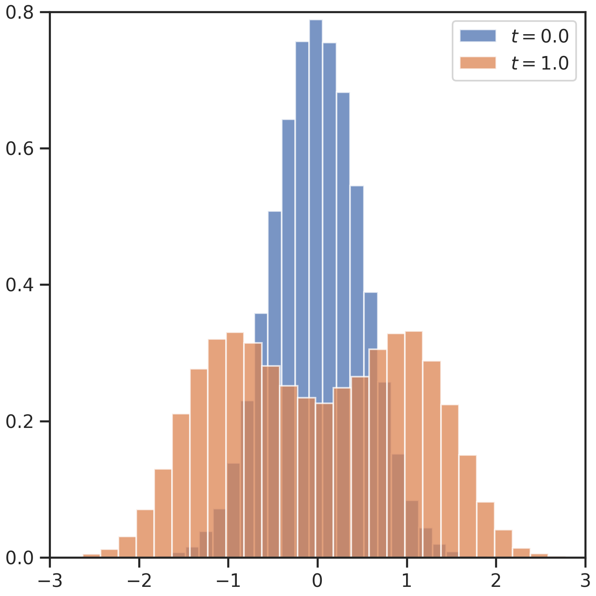

# Input Data

```python
import numpy as np

def drift(x, t):
    return -2 * np.power(x, 3) + 3 * x


def diffusion(x, t):
    return np.sqrt(np.power(x, 2) + 2)
```

```python
rng = np.random.default_rng(seed=0)
x0 = rng.normal(loc=0, scale=0.5, size=(1, 100000)).astype(np.float32)
t0 = 0.0
dt = 0.01
num_steps = 101
```

<br>
# Modular

```python
storage = storages.NumpyStorage(stride=10)
brownian_increment = increments.BrownianIncrement(seed=1)
scheme = schemes.ExplicitEulerMaruyamaScheme(drift, diffusion, brownian_increment)
sde_integrator = integrator.SDEIntegrator(scheme, storage)
```

```python
storage = sde_integrator.run(
    initial_state=x0, initial_time=t0, step_size=dt, num_steps=num_steps, progress_bar=True
)
```

```python
times, data = storage.values
_, ax = plt.subplots(figsize=(5, 5), layout="constrained")
ax.hist(data[0, :, 0], bins=30, density=True, alpha=0.75, label=rf"$t={times[0]:.1f}$")
ax.hist(data[0, :, -1], bins=30, density=True, alpha=0.75, label=rf"$t={times[-1]:.1f}$")
ax.set_xlim((-3, 3))
ax.set_ylim((0, 0.8))
ax.set_yticks((0, 0.2, 0.4, 0.6, 0.8))
ax.legend()
```

<figure markdown>
{ width="500" style="display: inline-block" }
</figure>


<br>
# Parallel Runner

```python
sde_runner = runner.ParallelRunner(
    drift_function=drift,
    diffusion_function=diffusion,
    scheme_type=schemes.ExplicitEulerMaruyamaScheme,
    increment_type=increments.BrownianIncrement,
    storage_type=storages.NumpyStorage,
    seed=0,
    stride=100,
    save_directory=Path("../results_example_parallel/result"),
    avoid_race_condition=True,
)
```

```python
storage = sde_runner.run(x0, t0, dt, num_steps, progress_bar=True)
storage.save()
```

```bash
mpirun -n <NUM_RPOCS> --map-by slot:PE=<NUM_THREADS_PER_PROC> python -m mpi4py parallel_runner.py
```